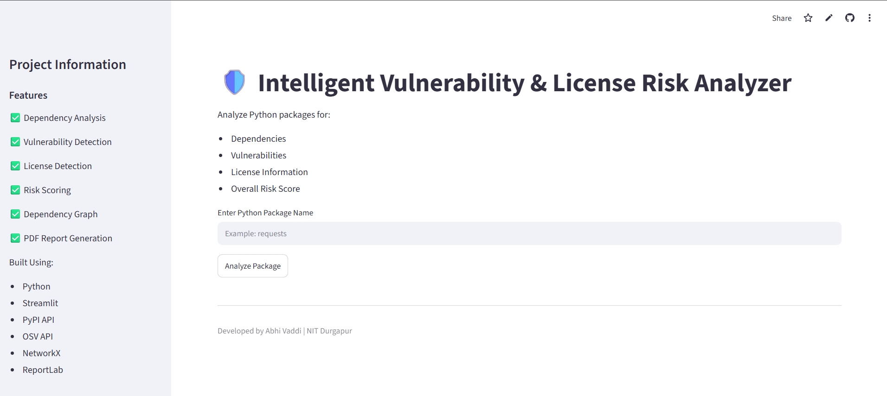
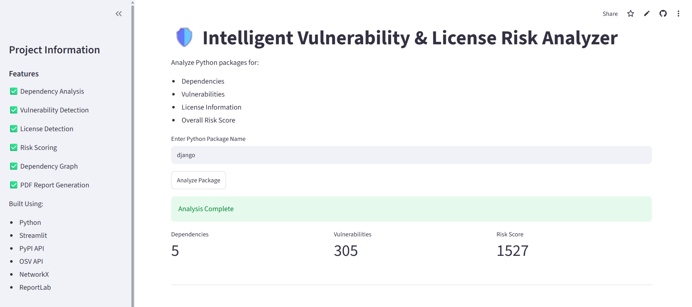
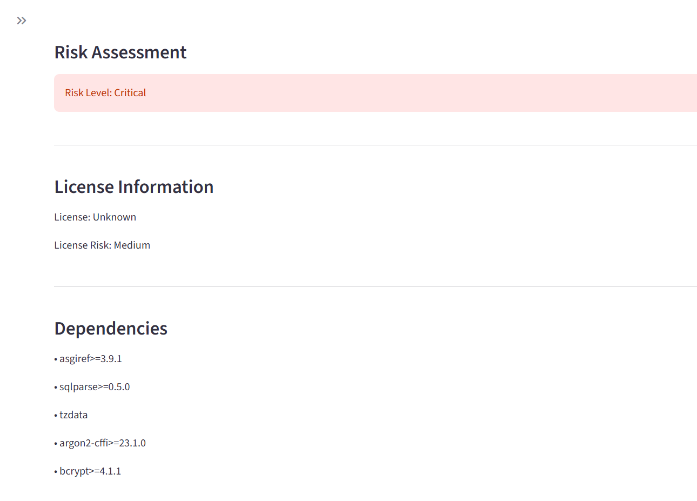
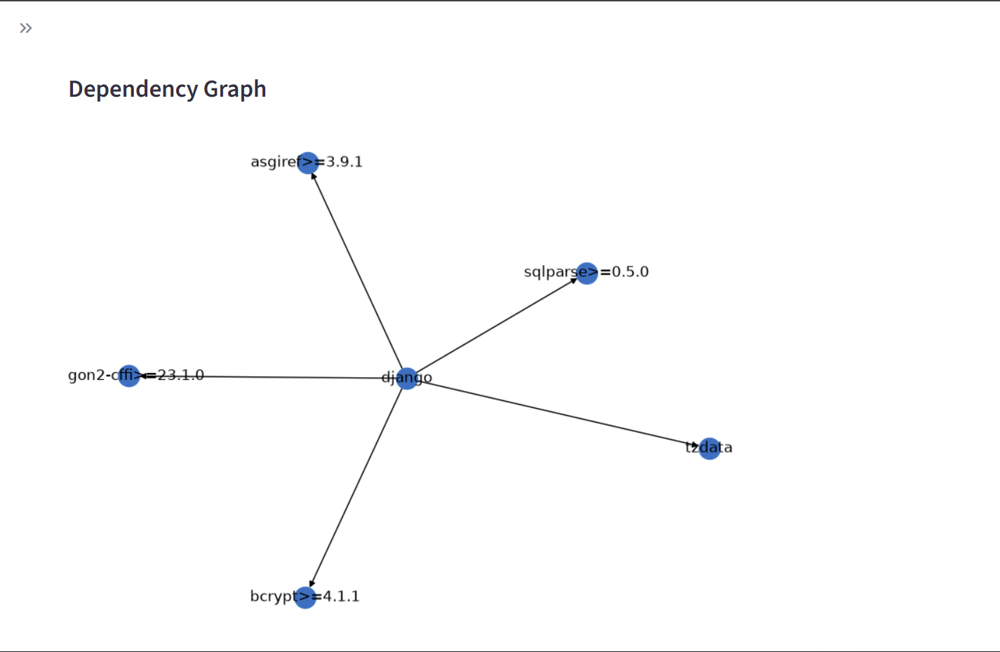

# 🛡️ Intelligent Vulnerability & License Risk Analyzer

## Overview

The **Intelligent Vulnerability & License Risk Analyzer** is a Python-based security analysis tool that evaluates Python packages by examining their dependencies, identifying known vulnerabilities, analyzing software licenses, and calculating an overall risk score.

The project helps developers gain insights into the security and compliance risks associated with open-source packages before integrating them into their applications.

---

## Live Demo

🔗 **Application Link:** *https://intelligent-risk-analyzer-be9xems5ymtfkkl5u4jncz.streamlit.app/*

---

## Features

✅ Dependency Analysis using PyPI metadata

✅ Vulnerability Detection using the OSV (Open Source Vulnerabilities) Database

✅ License Identification and Risk Classification

✅ Risk Score Calculation

✅ Risk Level Categorization (Low, Medium, High, Critical)

✅ Dependency Graph Visualization

✅ Interactive Streamlit Dashboard

✅ Modular and Scalable Architecture

---

## System Architecture

```text
                User
                  │
                  ▼
          Streamlit Dashboard
                  │
       ┌──────────┼──────────┐
       ▼          ▼          ▼
Dependency   Vulnerability  License
 Analyzer      Checker      Checker
       │          │          │
       └──────────┼──────────┘
                  ▼
           Risk Calculator
                  ▼
        Dependency Graph
                  ▼
             Final Results
```

---

## Project Structure

```text
intelligent-risk-analyzer/
│
├── app.py
├── requirements.txt
├── README.md
├── .gitignore
│
├── src/
│   ├── dependency_analyzer.py
│   ├── vulnerability_checker.py
│   ├── license_checker.py
│   ├── risk_calculator.py
│   ├── graph_generator.py
│   └── report_generator.py
│
├── screenshots/
│   ├── home.png
│   ├── analysis.png
│   └── graph.png
│
└── docs/
```

---

## Technology Stack

| Component     | Technology           |
| ------------- | -------------------- |
| Language      | Python               |
| Frontend      | Streamlit            |
| APIs          | PyPI API, OSV API    |
| Visualization | NetworkX, Matplotlib |
| HTTP Requests | Requests             |

---

## Workflow

1. User enters a Python package name.
2. The Dependency Analyzer fetches package dependencies from PyPI.
3. The Vulnerability Checker queries the OSV database for known vulnerabilities.
4. The License Checker identifies the package license.
5. The Risk Calculator computes a security score.
6. The Dependency Graph Visualizer generates a dependency relationship graph.
7. Results are displayed through the Streamlit dashboard.

---

## Risk Scoring Logic

The overall risk score is calculated using:

```text
Risk Score =
(5 × Vulnerability Count)
+ Dependency Risk Factor
+ License Risk Factor
```

### Risk Levels

| Score Range | Risk Level |
| ----------- | ---------- |
| 0 - 5       | Low        |
| 6 - 10      | Medium     |
| 11 - 15     | High       |
| 16+         | Critical   |

---

## Installation

### Clone Repository

```bash
git clone https://github.com/vaddi-abhi/intelligent-risk-analyzer.git

cd intelligent-risk-analyzer
```

### Create Virtual Environment

```bash
python -m venv venv
```

### Activate Environment

#### Windows

```bash
venv\Scripts\activate
```

#### Linux / macOS

```bash
source venv/bin/activate
```

### Install Dependencies

```bash
pip install -r requirements.txt
```

### Run Application

```bash
streamlit run app.py
```

---

## Screenshots

### Home Page

Add screenshot:

```text
screenshots/home.png
```

```markdown

```

---

### Analysis Results

Add screenshot:

```text
screenshots/analysis1.png
```

```markdown

```

```text
screenshots/analysis2.png
```

```markdown

```

---

### Dependency Graph

Add screenshot:

```text
screenshots/graph.png
```

```markdown

```

---

## Example Analysis

### Input

```text
requests
```

### Output

```text
Dependencies Found: 4

License: Apache-2.0

Vulnerabilities Found: 1

Risk Score: 8

Risk Level: Medium
```

---

## Learning Outcomes

Through this project, I gained practical experience with:

* REST API Integration
* Python Software Development
* Cybersecurity Fundamentals
* Dependency Analysis
* Vulnerability Assessment
* Risk Scoring Models
* Data Visualization
* Streamlit Application Development
* Modular Software Architecture

---

## Future Enhancements

* GitHub Repository Scanning
* Software Bill of Materials (SBOM) Generation
* Enhanced Risk Scoring Algorithms
* Support for Multiple Package Ecosystems
* Docker Image Analysis
* Automated Security Recommendations

---

## Author

**Abhi Vaddi**

B.Tech Computer Science and Engineering

National Institute of Technology Durgapur

GitHub: https://github.com/vaddi-abhi

```
```
